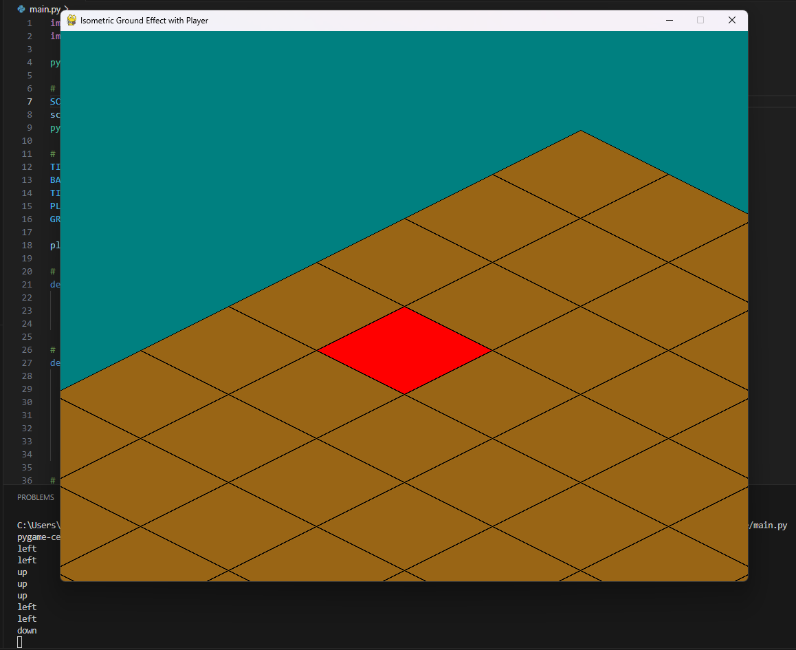
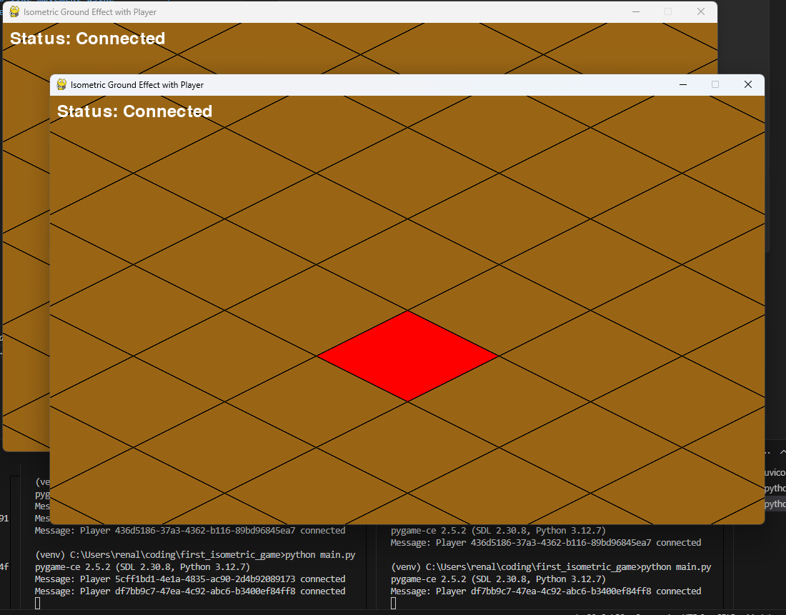

# first_isometric_game

## Isometric Ground Effect with Player

#### This model provides a basic isometric ground effect with a player tile that can move in a 2D grid. The game visually simulates 3D-like movement using isometric projections and allows for simple grid-based navigation.

```
- python -m venv venv
- venv\scripts\activate

- pip install pygame-ce
- pip install litestar[standard]
- pip install websocket-client

or:

- pip install requirements.txt


run server:
uvicorn server:app --reload

run client:
python main.py
```

Updates:

1. *Litestar implementation: Class based WebSocket handling*
1. *Server side: detailed docstrings added to server.py*
1. *Removed unneseccary annotations in server side for clarity*
1. *Encapsulated WebSocket event handlers with improvements*

Screenshots:


